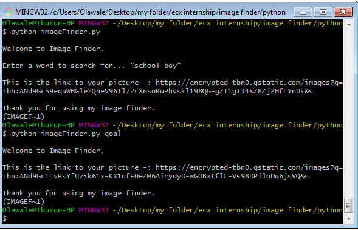

# Image Finder

Image Finder is a CLI tool that returns the link to the first image of any word entered into the terminal.


## 📸 Screenshots



## Getting started/Usage Guide

#### 1. Clone the repo

```sh
$ git clone https://github.com/olawale1rty/imageFinder.git
$ cd imageFinder
```

#### 2. [Setup and activate a virtual environment](https://programwithus.com/learn-to-code/Pip-and-virtualenv-on-Windows/)

#### 3. Get requirements

```sh
$ pip install -r requirements.txt
```

#### 4. Running the application

```sh
$ python imageFinder.py
```
```sh
$ python imageFinder.py "football"
```